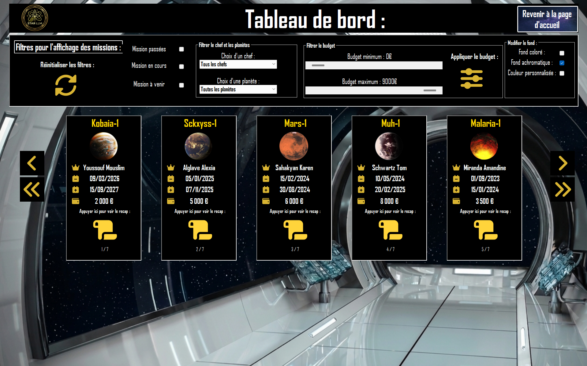
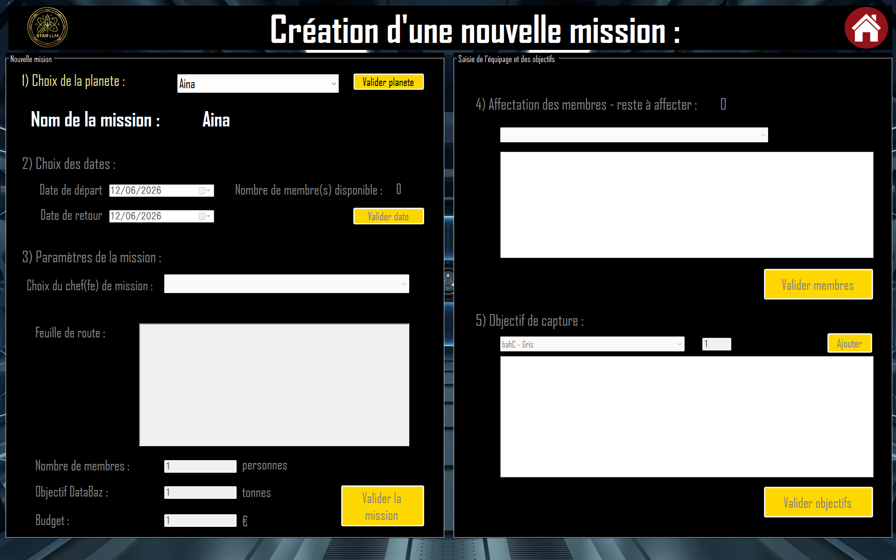
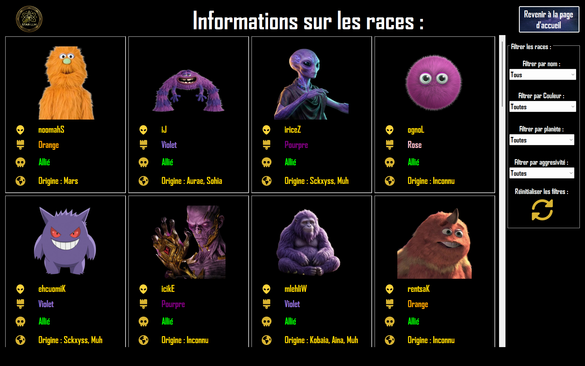

# Stargate-projet-IUT

# 🚀 Projet Stargate — SAE24

Application de gestion des missions spatiales développée dans le cadre de la SAE24 du BUT Informatique (IUT Robert Schuman, Université de Strasbourg).

---

## 📋 Description

**Stargate** est une application Windows Forms en C# permettant la gestion complète des missions d'exploration interstellaire. Elle couvre le suivi des équipages, des objectifs de capture d'extraterrestres, des dépenses, du journal de bord et des races et planètes répertoriées dans la galaxie.

---

## 📸 Aperçu

### Tableau de bord


### Création d'une nouvelle mission


### Données des races


---

## ✨ Fonctionnalités

| Volet | Description | Mode |
|-------|-------------|------|
| **1 — Tableau de bord** | Vue synthétique de toutes les missions (passées, en cours, à venir) avec export PDF | Connecté → Déconnecté |
| **2 — Nouvelle mission** | Création d'une mission, affectation des membres et définition des objectifs de capture (accès admin) | Connecté |
| **3 — Fiche mission** | Récapitulatif complet : équipage, budget, journal de bord, dépenses, contacts informateurs | Déconnecté + liaison de données |
| **4 — Visualisation événements** | Navigation dans le journal de bord mission par mission via liaison de données | Liaison de données |
| **5 — Races répertoriées** | Parcours et filtrage des espèces alliées et ennemies avec leurs caractéristiques | Déconnecté |
| **6 — Informations planètes** | Atmosphère, gravité, présence de DataBaz, espèces présentes, missions passées | Déconnecté |
| **7 — Statistiques** | Requêtes avancées : co-équipiers, dépenses par mission, missions par planète, informateurs… | Connecté |

### Fonctionnalités techniques notables
- 🔐 Authentification administrateur avec mot de passe **haché (BCrypt)**
- 📄 Export **PDF** des rapports de mission (via PdfSharp/MigraDoc)
- 🗄️ Base de données **SQLite** (`Stargate.db`)
- 📊 **DataSet local** partagé via `mesDatas.cs` pour le mode déconnecté
- 🔒 Gestion des **transactions SQL** pour la saisie des objectifs de capture
- 🎨 Interface animée avec effets de sliding/bouncing sur les boutons

---

## 🏗️ Architecture du projet

```
SAE24_Stargate/
├── SAE24_Stargate.sln          # Solution principale (projet fusionné)
├── SAE24_Stargate (4)/
│   ├── Program.cs              # Point d'entrée
│   ├── Connexion.cs            # Gestion de la connexion SQLite
│   ├── mesDatas.cs             # DataSet partagé (mode déconnecté)
│   ├── Form1.cs                # Formulaire de chargement / splash screen
│   ├── frmTableauDeBord.cs     # Volet 1 — Tableau de bord
│   ├── frmNM.cs                # Volet 2 — Nouvelle mission
│   ├── frmMDP.cs               # Authentification admin
│   ├── frmEditionMission.cs    # Volet 3 — Fiche et édition mission
│   ├── frmInfoAlien.cs         # Volet 5 — Races répertoriées
│   ├── frmDetailAlien.cs       # Détail d'une race
│   ├── frmInfoPlanetes.cs      # Volet 6 — Planètes
│   ├── frmMoreInfoPlanetes.cs  # Détail d'une planète
│   ├── frmStat.cs              # Volet 7 — Statistiques
│   ├── frmMissionTermine.cs    # Marquage mission terminée
│   ├── frmVerifQuitter.cs      # Dialogue de confirmation quitter
│   └── bin/Debug/
│       └── Stargate.db         # Base de données SQLite
│
└── UserControls/               # Contrôles réutilisables (sous-projets séparés)
    ├── ucAlien/                # Affichage d'une carte race
    ├── ucBudget/               # Widget budget mission
    ├── ucMember/               # Carte membre d'équipage
    ├── ucInfoPlanetes/         # Carte planète
    ├── ucDetailPlanete/        # Détail planète
    ├── ucInformateur/          # Ligne informateur
    ├── ucRecapMission/         # Résumé mission (tableau de bord)
    ├── ucRecapMissionEntier/   # Résumé mission complet
    └── ucNbMissionPlanete/     # Compteur missions par planète
```

---

## 🗄️ Base de données

La base SQLite `Stargate.db` (dans `bin/Debug/`) contient les tables suivantes :

`Planete` · `Espece` · `Allie` · `Ennemi` · `Habiter` · `Membre` · `Civil` · `Militaire` · `Mission` · `Composer` · `Depense` · `TypeDepense` · `JournalDeBord` · `Contact` · `Informateur` · `Capturer` · `ObjectifCapture` · `Negocier` · `Admin`

---

## 🚀 Installation et lancement

### Prérequis

- **Windows** (application WinForms .NET Framework)
- **Visual Studio 2022** (ou version compatible)
- **.NET Framework 4.x**
- Les packages NuGet sont inclus dans le dossier `packages/`, aucune installation manuelle n'est nécessaire

### Étapes

1. **Cloner le dépôt**
   ```bash
   git clone https://github.com/<votre-pseudo>/<nom-du-repo>.git
   ```

2. **Ouvrir la solution** dans Visual Studio :
   ```
   SAE24_Stargate (4)/SAE24_Stargate.sln
   ```

3. **Restaurer les packages NuGet** si nécessaire (clic droit sur la solution → *Restore NuGet Packages*)

4. **Vérifier que `Stargate.db` est présent** dans `bin/Debug/`. Si ce n'est pas le cas, copier la base depuis la racine du projet.

5. **Lancer le projet** (`F5` ou bouton *Démarrer*)

---

## 🔑 Accès administrateur

La création de nouvelles missions est réservée aux administrateurs. Utilisez les identifiants suivants (base de test incluse) :

| Login | Mot de passe |
|-------|-------------|
| `Admin` | `admin` |

> Le mot de passe est stocké sous forme de hash BCrypt dans la table `Admin`.

---

## 📦 Dépendances (NuGet)

| Package | Version | Usage |
|---------|---------|-------|
| `System.Data.SQLite.Core` | 1.0.119.0 | Base de données SQLite |
| `BCrypt.Net-Core` | 1.6.0 | Hachage des mots de passe |
| `PDFSharp.Standard` | 1.51.15 | Génération de PDF |
| `PdfSharp.MigraDoc.Standard` | 1.51.15 | Mise en page PDF |

---

## 👥 Auteurs

Projet réalisé par **Maxence** et son trinome ([@LucasTreiber](https://github.com/LucasTreiber) et [@LouisCasella](https://github.com/LouisCasella) ) dans le cadre de la **SAE24 — BUT Informatique 1ère année**, IUT Robert Schuman, Université de Strasbourg — Session 2026.
